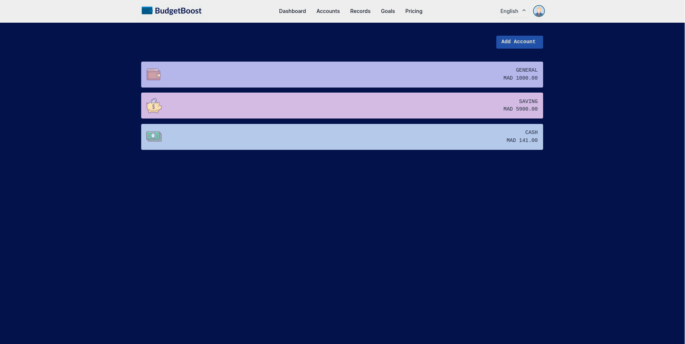
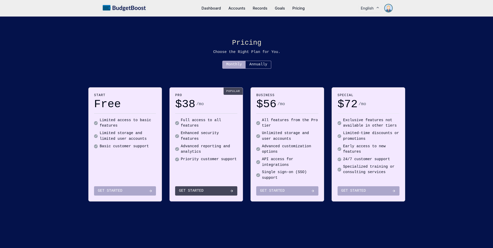

## 📌 About The Project

A financial management web application designed to help users effectively manage their accounts, track expenses and icomes, and set financial goals.

### Built With
* 
* 
* 
* 

# Screenshots

#### Login

#### Dashboard

#### Accounts

#### Records

#### Goals

#### pricing

## Getting Started 
1. Make sure you have [composer](https://getcomposer.org/download/) installed.
2. Make sure you have latest stable version of [node](https://nodejs.org/en/download/) installed.

## Installation
1. `git clone https://github.com/soumiya59/budgetBoost.git`
2. `cd budgetBoost`
3. `cd backend && composer install && composer update`
4.  in backend folder Copy content of .env.example and paste it in a new file called .env and run `php artisan key:generate`
5.  in frontend folder Copy content of .env.example and paste it in a new file called .env
6. `cd frontend` 
7. `npm install`

## Development
- `cd backend && php artisan migrate`
- `php artisan db:seed --class=CategorySeeder`
- `php artisan db:seed`
- `php artisan serve`
- in another terminal `cd frontend && npm run dev` to run React app (if not working then --force)
